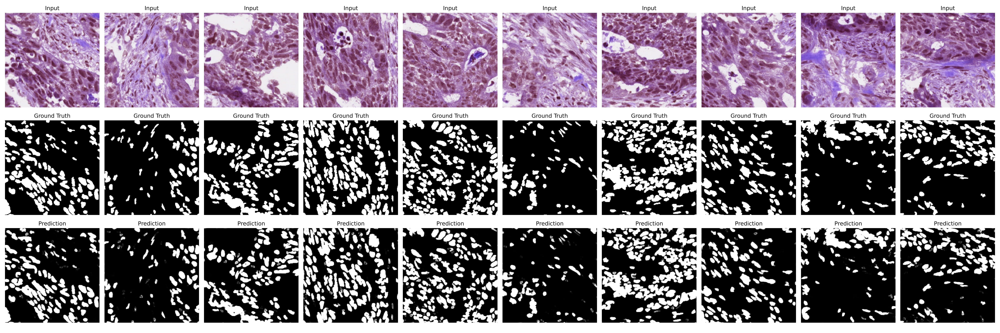
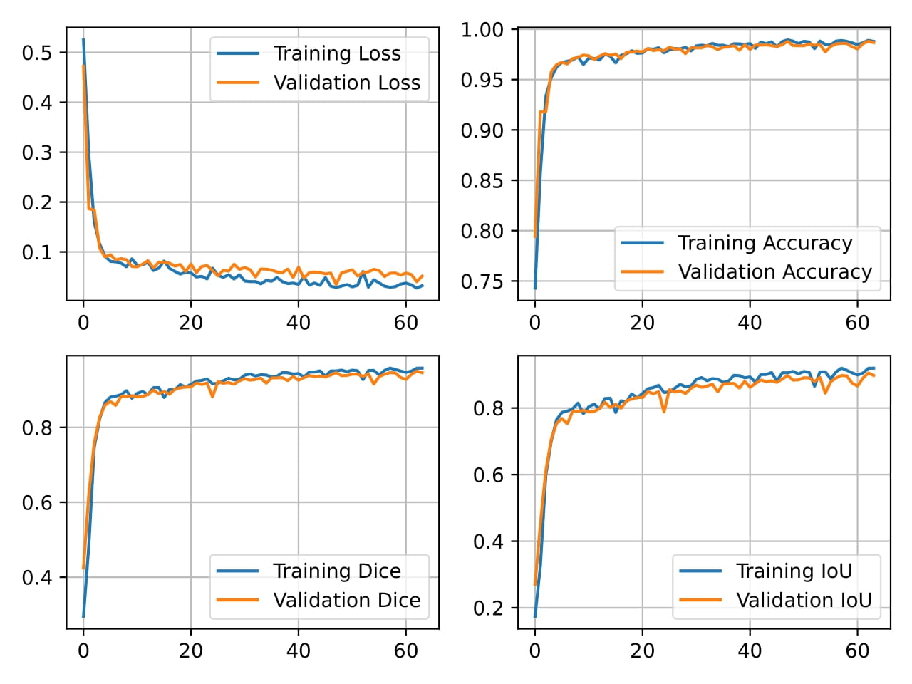
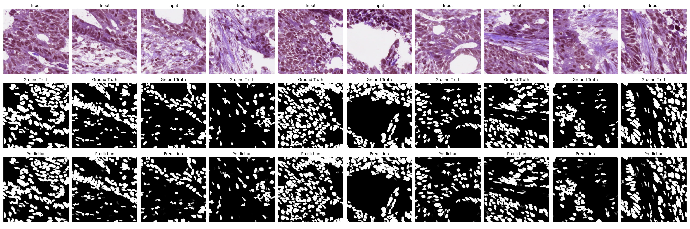
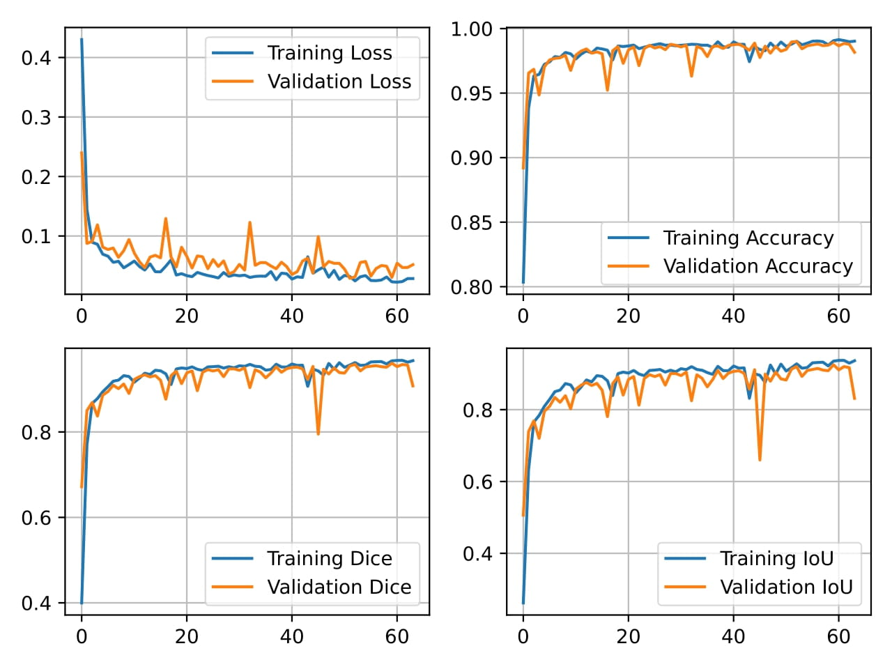
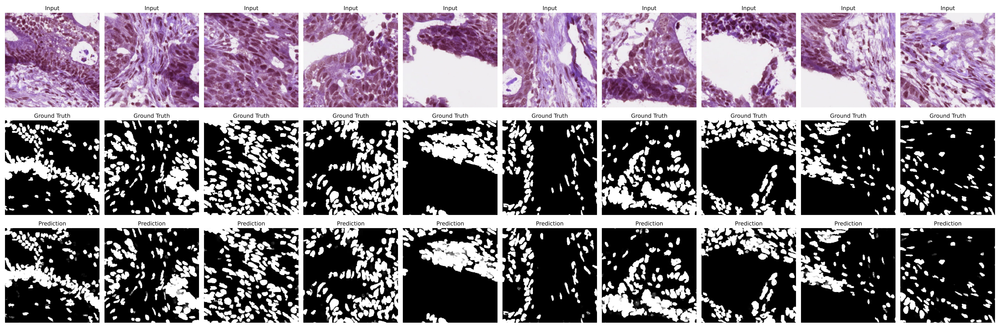
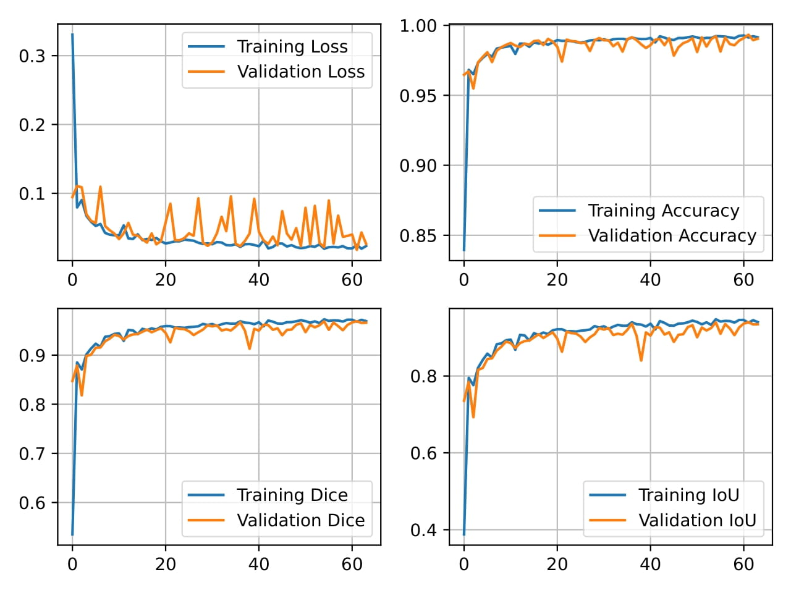
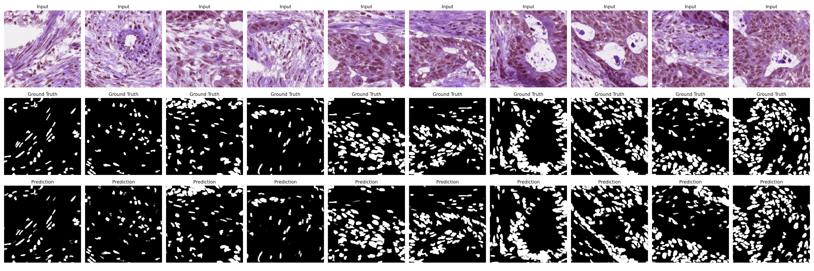
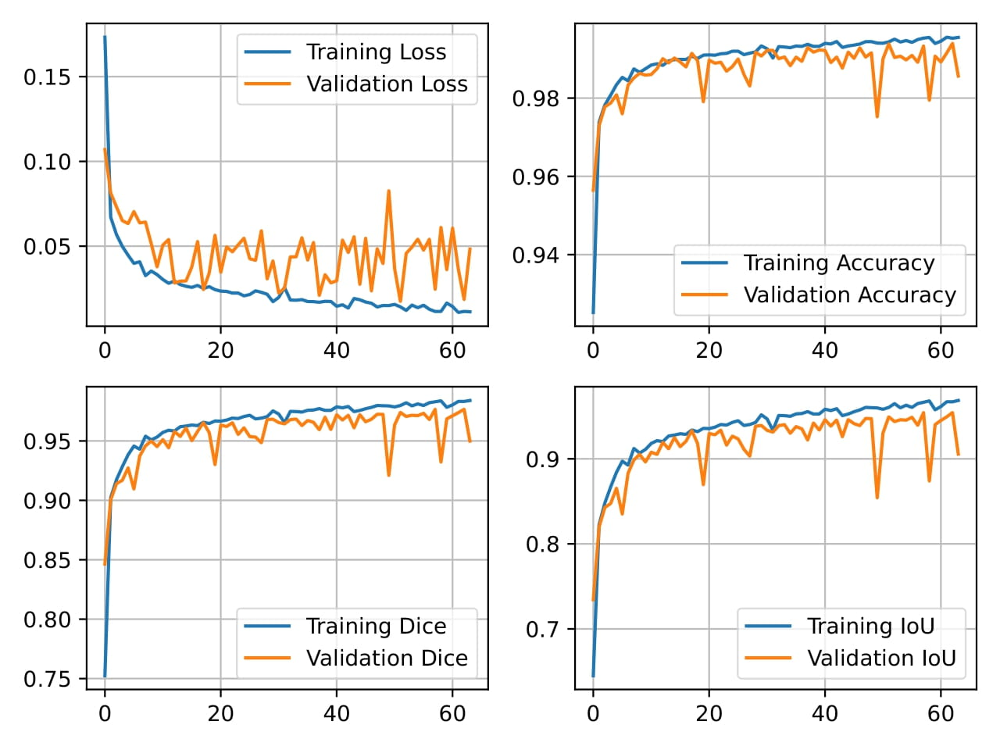
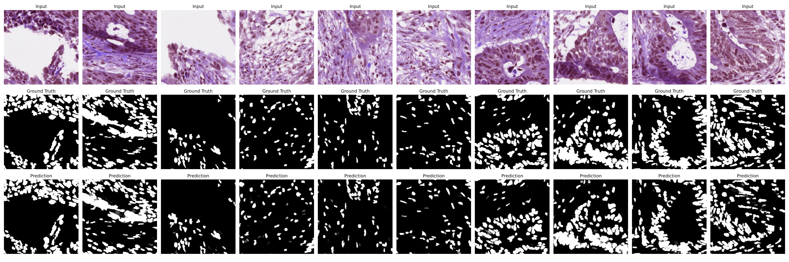
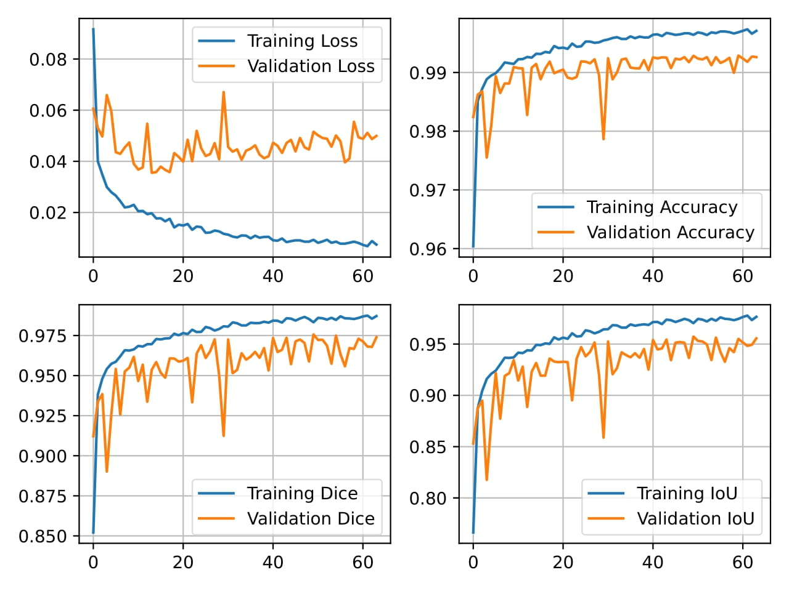

# BE 544: Weakly Supervised Nuclei Segmentation Project

By: **Hossam M. Balaha**
 
C.V.: https://hossambalaha.github.io/

## Overview

The project is to segment nuclei in histopathology images using U-Net. The dataset is from
the [Genomic Data Commons Data Portal](https://portal.gdc.cancer.gov/). The used whole slide image (WSI)
name is `TCGA-AA-3562-01A-01-BS1.2bc37a71-647d-4e7e-9e3a-12191942a051.svs`. The full details can be found in the
PDF named `BE544_Assignment2_Segmentation.pdf`.

## Masks Creation

QuPath is used to annotate the nuclei in the whole slide image (WSI). 
The annotation are used to create the masks for the training, validation, and testing subsets.

The process of creating a pixel classifier is as follows: 

(1) Creating a thresholder as shown below.

(2) Creating objects using the thresholder as shown below.

The final annotations are shown below. The red portion is used for training and validation while the 
green portion is used for testing.

## Training History and Sample Outputs

Five experiments using different batch sizes are performed. For each experiment, the training and validation
history are plotted. 10 sample outputs are shown also for each experiment.

By training the network using `BCE` loss function, `Adam` optimizer, `64` epochs, and batch size of `32`, 
the following outputs were obtained:

 

By training the network using `BCE` loss function, `Adam` optimizer, `64` epochs, and batch size of `16`, 
the following outputs were obtained:

 

By training the network using `BCE` loss function, `Adam` optimizer, `64` epochs, and batch size of `8`, 
the following outputs were obtained:

 

By training the network using `BCE` loss function, `Adam` optimizer, `64` epochs, and batch size of `4`, 
the following outputs were obtained:

 

By training the network using `BCE` loss function, `Adam` optimizer, `64` epochs, and batch size of `1`, 
the following outputs were obtained:

 

## Project Repo. on GitHub

**Link**: https://github.com/HossamBalaha/BE-544-Weakly-Supervised-Nuclei-Segmentation-Project

## Copyright

All rights reserved. No part of this publication may be reproduced, distributed or
transmitted in any form or by any means, including photocopying, recording or other
electronic or mechanical methods, without the prior written permission of me, except in
the case of brief quotations embodied in critical reviews and certain other non-
commercial uses permitted by copyright law. For permission requests, write to the
publisher at the address below.
Email: `h3ossam@gmail.com`